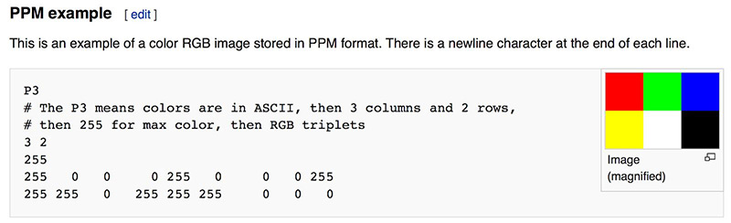

# Section 1: Output an image

## PPM file format
### Theoretical concept
- The portable pixelmap PPM file format is stores data in a very simple format with the file format, size of columns and rows, the inteager value corresponding to maximum pixel value of 1.0 and the RGB triplets. Each color has a value that goes from 0.0(black) to 1.0(white) maximum. A typical PPM file looks like this. simple enough to type it out actually!

  

- These RGB triplets are written from left to right and top to bottom
### Coding concept
- "auto" keyword is used to deduce the datatype of the variable(also called type deduction).  
Example: auto x = 4.0 // compiler automatically deduces the varible as float type 
-   

## Creating an Image File
- 
 
